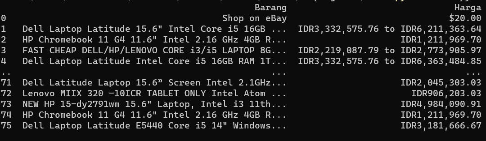

<p align="center"

Nama: Alif Nur Fathlii Amarta

<p align="center"

NIM: 312210326

<p align="center"

Kelas: TI.22.A3

# Web Scraping

Data Scraping adalah suatu teknik dalam mengumpulkan data dariberbagai sumber data.

Salah satunya adalah dari website,sehingga lebih dikenal dengan Web Scraping.

---


bahan yang dibutuhkan adalah 
- Panda
- BeautifulSoup
- Requests

untuk install Panda gunakan

    pip install panda

untuk install BeautifulSoup gunakan

    pip install BeautifulSoup4

untuk install Requests gunakan

    pip install requests

# Latihan

Ambil contoh web marketplace Ebay lalu salin link ke variable URL 

```
URL = "https://www.ebay.com/sch/i.html?_from=R40&_trksid=p2380057.m570.l1313&_nkw=laptop&_sacat=0"
page = req.get(URL)
soup = bs(page.content, 'html.parser')
```

Soup akan menganalisis konten nya dengan html 

---

Gunakan soup untuk mencari item produknya 

    produk = soup.find_all('li', attrs={'class': 's-item'})

buat list nya dan tambahkan list nya 

```
nama_produk = []
harga_produk = []
for item in produk:
  nama = item.find('div', attrs={'class': 's-item__title'}).text
  harga = item.find('span', attrs={'class': 's-item__price'}).text
  nama_produk.append(nama)
  harga_produk.append(harga)
```
---

buat dataframee untuk list menggunakan panda

```
df = pd.DataFrame({'Barang': nama_produk, 'Harga': harga_produk})

print(df)
```

## Output

